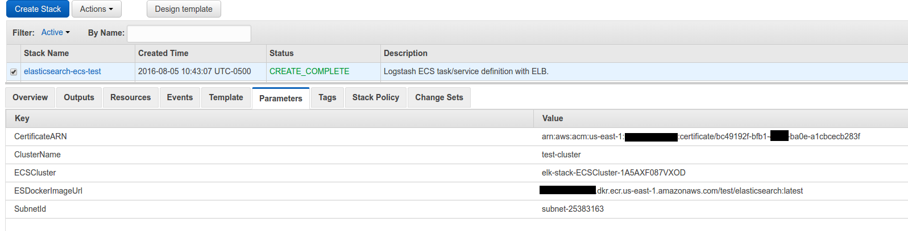
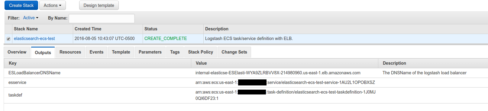

This will be a write-up on how to get a self-healing and self-curating SSL-enabled Hot/Warm ELK stack using ECS and lambda <!-- more -->

Disclaimer
==========

I'm redacting any information that might seem sensitive such as account numbers. Use your discretion and make sure you use values that make sense for things blacked out in images or in `{}` notation.

Part 1a - ECS Base Instances
===========================

This is actually one of the easier pieces. We need a base ECS cluster to run our tasks on. [This cloudformation template](https://github.com/myoung34/elk-docker-aws/blob/master/ecs_base/cloudformation.json) assumes your VPC is connectible, etc. If your VPC is compatible, just upload that file in cloudformation and when it's done, you'll have a cluster ready!

The params tab:


After completion:


If you were to go to your ECS tab in your AWS console, you will see a new cluster with the name `elk-stack-ECSCluster-1A5AXF087VXOD` and eventually you would have 4 EC2 instances available for running tasks.

Part 1b - Elasticsearch
=======================

First thing we need to do is build the container and push it to ECR.

In the ECR portion of the AWS console, create a new repository called `test/elasticsearch`.

Then in your console for [the elasticsearch dockerfile](https://github.com/myoung34/elk-docker-aws/tree/master/elasticsearch) run:

```
docker build -t elasticsearch:local .
docker tag elasticsearch:local \
   {acctnum}.dkr.ecr.us-east-1.amazonaws.com/test/elasticsearch:latest
$(aws ecr get-login)
docker push {acctnum}.dkr.ecr.us-east-1.amazonaws.com/test/elasticsearch:latest
```

Once this is pushed you can verify it by looking for a tag `latest` in your `test/elasticsearch` ECR repository.

Next upload [this cloudformation template](https://github.com/myoung34/elk-docker-aws/blob/master/elasticsearch/cloudformation.json) to Cloudformation (modifying the parameters as you need).

The parameters I used:



And the output tab:



If you paid enough attention to the code in the [docker-entrypoint.sh](https://github.com/myoung34/elk-docker-aws/blob/master/elasticsearch/docker-entrypoint.sh) file you might notice this line: ``export NODE_TYPE=$([[ `echo $((1 + RANDOM % 2))` -eq "1" ]] && echo warm || echo hot)``.

That, along with the [elasticsearch configuration yaml](https://github.com/myoung34/elk-docker-aws/blob/master/elasticsearch/elasticsearch.yml), namely the line: `node.box_type: ${NODE_TYPE}` gives you a random 50/50 chance of getting a "hot" or "warm" node. [The hot/warm architecture is outlined here](https://www.elastic.co/blog/hot-warm-architecture) but basically you're going to have nodes that have attributes `box_type: hot` or `box_type: warm`. We'll go over how the data matters later, but for now you can verify that like in these screen shots by browsing to your elastic load balancer such as: `internal-elasticse-ESElasti-WYA9ZLRBVV8X-214980960.us-east-1.elb.amazonaws.com:9200/_plugin/kopf` and viewing the attributes for your node.


You now have an SSL-enabled ELK stack that will have hot or warm nodes.

Takeaways
=========

SSL is enabled by using NGINX as an SSL-listener in front of the ES port `9200` using self-signed certs. Elasticsearch is configured to use `19200` but broadcast `9200`. This lets the nodes themselves talk over SSL using insecure TLS, but they look normal to the outside world. The Load balancer uses ACM from Amazon with a real domain `*.dev.mydom.com` (in my screenshots) to terminate SSL with a real chain, but communicates over TCP to the ES nodes to the self-signed server.

The reason for doing this: things like to be able to verify the chain, and don't like self-signed certs. As you see in my screen shot, since I used route53 to point `es-test.dev.mydom.com` to the ELB (which uses a valid ACM cert), everything is encrypted but outward facing services will not have chain errors.

Hot-warm could be better implemented, but for demonstration purposes, 50/50 is fine if you spin up 4+ nodes. If you only use 2 ECS tasks such as the screen shots, you might end up with both hot or both warm. If you're following along, you'll want at least one of each for curator to make sense.
