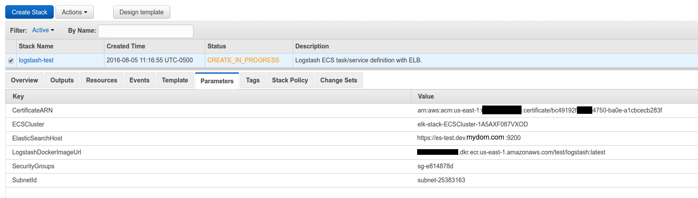

The previous part focused on getting the ECS cluster, ECR repos, and Elasticsearch up. This one focuses on getting Logstash <!-- more -->

Disclaimer
==========

I'm redacting any information that might seem sensitive such as account numbers. Use your discretion and make sure you use values that make sense for things blacked out in images or in `{}` notation.

Part 2a - Logstash
===========================

First thing we need to do is build the container and push it to ECR.

In the ECR portion of the AWS console, create a new repository called `test/logstash`.

Then in your console for [the logstash dockerfile](https://github.com/myoung34/elk-docker-aws/blob/master/logstash/Dockerfile) run:

```
docker build -t logstash:local .
docker tag logstash:local \
   {acctnum}.dkr.ecr.us-east-1.amazonaws.com/test/logstash:latest
$(aws ecr get-login)
docker push {acctnum}.dkr.ecr.us-east-1.amazonaws.com/test/logstash:latest
```

Once this is pushed you can verify it by looking for a tag `latest` in your `test/logstash` ECR repository.

Next upload [this cloudformation template](https://github.com/myoung34/elk-docker-aws/blob/master/logstash/cloudformation.json) to Cloudformation (modifying the parameters as you need).



You now have a listening logstash instance! My next step would be to configure a Route53 domain name to point to the logstash load balancer so you can have real SSL without any chain issues.

Takeaways
=========

Similar to what we did with elasticsearch, logstash is listening on port `5000` for beats input. It uses self-signed SSL certificates. Most beats forwarders won't play nice with that out of the box, but if you configure Route53 to point to the ELB and use ACM, it will be valid SSL. The load balancer will use TCP to send to the logstash instances and not care that it is self-signed.

The [logstash configuration file](https://github.com/myoung34/elk-docker-aws/blob/master/logstash/logstash.conf) uses dynamic indexes, so whatever you set `document_type` on your beats configuration to will become the index.

Part 2b - Send to logstash
==========================

Install the latest stable logstash and use this filebeat configuration to get ready to ship:

```
filebeat:
  prospectors:
    -
      paths:
        - "/var/log/test/*"
      encoding: plain
      input_type: log
      fields_under_root: true
      document_type: test
output:
  logstash:
    hosts: ["log-test.dev.mydom.com:5000"]
```

Next make sure that directory exists via `sudo mkdir /var/log/test` and start the service (depends on your OS): `sudo service filebeat start`.

Lastly, lets send something to logstash: `echo asdf | sudo tee -a /var/log/test/$(uuidgen)`. That will generate a random file and put `asdf` into it. It should show up in your kopf plugin to view:


