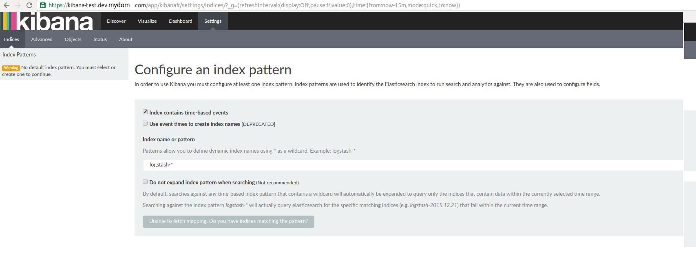

The previous part focused on getting logstash up. This one focuses on getting Kibana <!-- more -->

Disclaimer
==========

I'm redacting any information that might seem sensitive such as account numbers. Use your discretion and make sure you use values that make sense for things blacked out in images or in `{}` notation.

Part 2 - Kibana
===========================

First thing we need to do is build the container and push it to ECR.

In the ECR portion of the AWS console, create a new repository called `test/kibana`.

Then in your console for [the kibana dockerfile](https://github.com/myoung34/elk-docker-aws/blob/master/kibana/Dockerfile) run:

```
docker build -t kibana:local .
docker tag kibana:local \
   {acctnum}.dkr.ecr.us-east-1.amazonaws.com/test/kibana:latest
$(aws ecr get-login)
docker push {acctnum}.dkr.ecr.us-east-1.amazonaws.com/test/kibana:latest
```

Once this is pushed you can verify it by looking for a tag `latest` in your `test/kibana` ECR repository.

Next upload [this cloudformation template](https://github.com/myoung34/elk-docker-aws/blob/master/kibana/cloudformation.json) to Cloudformation (modifying the parameters as you need).

It will look almost exactly like the logstash upload in terms of parameters.

You now have a kibana instance! My next step would be to configure a Route53 domain name to point to the kibana load balancer so you can have real SSL without any chain issues.

Takeaways
=========

Similar to what we did with elasticsearch and logstash, kibana is listening on port `5601` via HTTPS. It uses self-signed SSL certificates. The dockerfile is actually identical to the verified one on the Dockerhub, except I expanded the `docker-entrypoint.sh` to take more parameters since the base one doesn't allow much configurability: https://github.com/docker-library/kibana/pull/45

If you browse to your ELB or route53 entry on port 443, you'll be greeted by kibana.



If you configure your index to `test-*` your dashboard will show the logs Logstash ingested!


