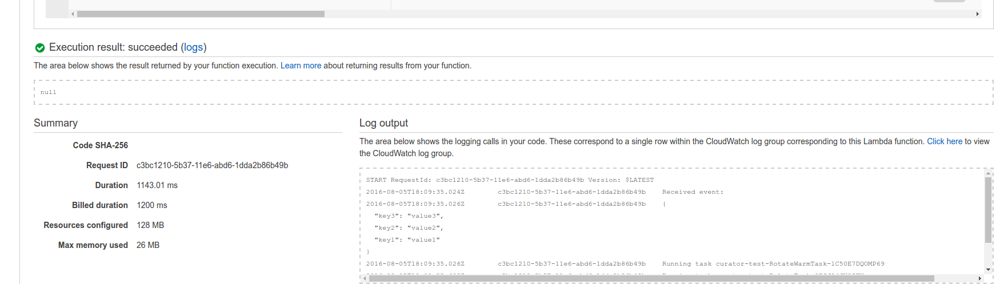
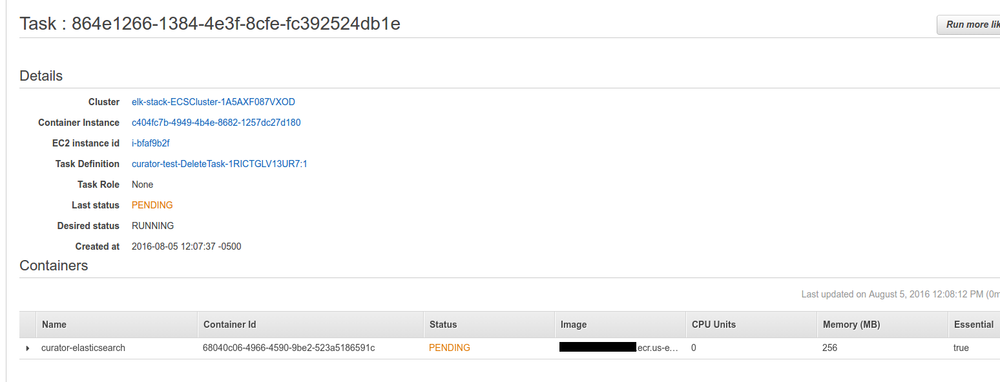
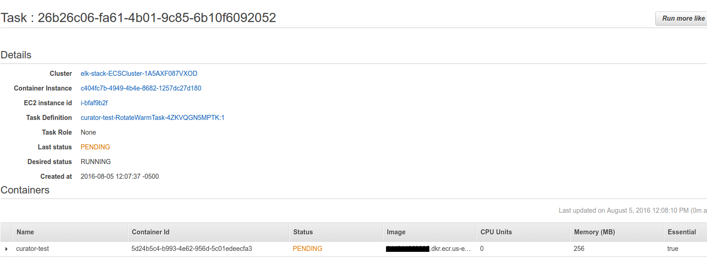
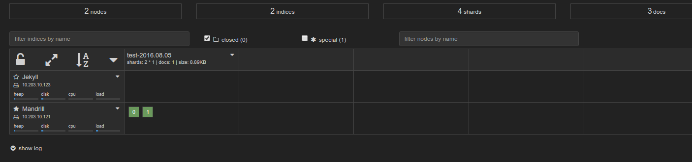

The previous part focused on getting Kibana up. This one focuses on getting Curator <!-- more -->

Disclaimer
==========

I'm redacting any information that might seem sensitive such as account numbers. Use your discretion and make sure you use values that make sense for things blacked out in images or in `{}` notation.

Part 2 - Curator
===========================

This is the coolest part of the whole stack.

We're basically going to build/deploy a docker image for Curator, then upload a cloudformation template that creates a Lambda function to run it.

The lambda function will have a trigger of your choice (probably a scheduled event for once a day if I had to guess) and will run two tasks.

Task 1 is a rotate warm task that will tell Elasticsearch to move any indexes to warm that (in this case) are 0 days old (for demo purposes).
Task 2 is a delete task that tells Elasticsearch to delete any indexes older than 14 days.

You can expand this to stagger them, take snapshots, etc. This allows you to have schedules that define how the data moves from box to box or to backups!

First thing we need to do is build the container and push it to ECR.

In the ECR portion of the AWS console, create a new repository called `test/curator`.

Then in your console for [the curator dockerfile](https://github.com/myoung34/elk-docker-aws/blob/master/curator/Dockerfile) run:

```
docker build -t curator:local .
docker tag curator:local \
   {acctnum}.dkr.ecr.us-east-1.amazonaws.com/test/curator:latest
$(aws ecr get-login)
docker push {acctnum}.dkr.ecr.us-east-1.amazonaws.com/test/curator:latest
```

Once this is pushed you can verify it by looking for a tag `latest` in your `test/curator` ECR repository.

Next upload [this cloudformation template](https://github.com/myoung34/elk-docker-aws/blob/master/curator/cloudformation.json) to Cloudformation (modifying the parameters as you need).


Once it is complete, go to the Lambda portion of AWS and click your function that was created. You can test it by clicking "Test" and just hitting "submit".

You will see some output such as:



If you go to the ECS console quickly you will see two tasks have been created and are being run for the first time (will be in pending for a minute while the image is being pulled to the instance running it).





And now if you look at your kopf plugin you will see the data move from the "hot" node:


To eventually the "warm" node:



